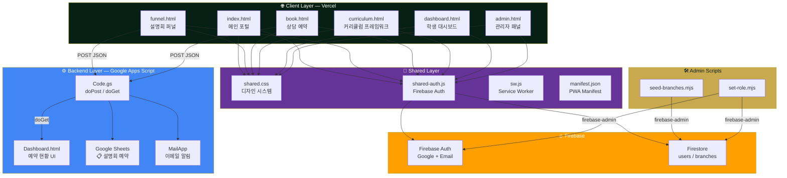

<div align="center">

# 📢 ReadMaster Funnel

**마케팅 퍼널 · 설명회 예약 · 리드 수집 · CRM 자동화**

읽는 힘이 모든 학습의 시작입니다

[](https://developer.mozilla.org/en-US/docs/Web/HTML)
[](https://developer.mozilla.org/en-US/docs/Web/CSS)
[](https://firebase.google.com/)
[](https://developers.google.com/apps-script)
[](https://vercel.com/)
[](https://web.dev/progressive-web-apps/)

<br/>

ReadMaster Franchise Ecosystem의 **마케팅 퍼널 레이어** — 학부모 설명회 예약, 상담 리드 수집,<br/>
커리큘럼 소개를 담당하는 풀 마케팅 사이트입니다.

[라이브 데모](https://readmaster-funnel.vercel.app) · [에코시스템 허브](https://readmaster-franchise.vercel.app) · [이슈 제보](https://github.com/Reasonofmoon/readmaster-funnel/issues)

</div>

---

## 🧭 Philosophy

> **"학부모의 첫 터치포인트에서 전환까지, 마찰 없는 퍼널을 만든다."**

일반적인 학원 홈페이지는 정보를 나열할 뿐, 전환(Conversion)을 설계하지 않습니다. ReadMaster Funnel은 마케팅 퍼널 관점에서 **인지 → 관심 → 상담 예약 → CRM 등록**까지의 전체 여정을 하나의 사이트 안에 구현합니다.

| 관점 | 일반 학원 사이트 | ReadMaster Funnel |
|------|-----------------|-------------------|
| **설계 목표** | 정보 전달 | 전환율 최적화 |
| **리드 수집** | 전화 문의만 | 폼 → GAS → Google Sheets → 이메일 알림 자동화 |
| **인증** | 없음 | Firebase Auth (Google/Email) + 역할 기반 접근 |
| **커리큘럼** | PDF 첨부 | 인터랙티브 표준화 프레임워크 (사이드바 TOC, 데이터 테이블) |
| **CRM 대시보드** | 별도 앱 | GAS 내장 대시보드 + 관리자 패널 일체형 |
| **멀티 지점** | 지점별 별도 사이트 | Firestore 기반 동적 지점 테마 + 브랜치 관리 |
| **PWA** | 미지원 | 설치 가능한 오프라인 앱 |

---

## 🏗️ Architecture



---

## ✨ Layer-by-Layer Feature Breakdown

### 🎯 Layer 1 — 마케팅 퍼널 (`funnel.html`)

학부모 설명회 전환을 위한 전용 랜딩 페이지.

| Feature | Description |
|---------|-------------|
| **선착순 FOMO 배지** | "선착순 20명" 펄스 애니메이션으로 긴박감 연출 |
| **모바일 플로팅 CTA** | 하단 고정 버튼으로 이탈 방지 |
| **멀티스텝 예약 폼** | 학부모 정보 → 자녀 학년 → 희망 일정, 단계별 진행 |
| **GAS 자동 연동** | 폼 제출 → Google Sheets 자동 기록 + 이메일 알림 |

> **Wow Moment** — 예약 폼 제출 시 Google Sheets에 즉시 기록되고, 원장에게 이메일 알림이 발송됩니다. 별도 서버 없이 Google Apps Script만으로 완전한 CRM 파이프라인을 구현했습니다.

### 🏠 Layer 2 — 메인 포털 (`index.html`)

100KB+ 단일 HTML로 구현된 풀 브랜드 사이트.

| Feature | Description |
|---------|-------------|
| **4-슬라이드 공지 배너** | 설명회, 레벨테스트, 신규 프로그램 자동 순환 |
| **비디오 모션 섹션** | `kinetic_bg.mp4` 배경의 몰입형 스크롤 스토리텔링 |
| **문해력 9단계 체계** | GLEAS-CAT 기반 Gem Level Grid (9레벨 시각화) |
| **8개 모듈 통합 플랫폼** | 읽기/쓰기/토론/어휘 등 교육 모듈 카드 |
| **RMLI 통합 진단** | 문해력 레벨테스트 UI (IRT 기반 적응형) |
| **큐레이션 서재** | 장르별 필터링 도서 라이브러리 |
| **IELTS 대비 프로그램** | 밴드 스케일 시각화 + AI 학습 상태 뱃지 |
| **영어 토론 도서관** | 토론 플로우 다이어그램 + 카테고리별 토론 주제 |
| **학부모 후기** | 별점 + 사용 후기 카드 그리드 |
| **개원 로드맵** | 단계별 프랜차이즈 오픈 타임라인 |

> **Wow Moment** — 수능 등급 매핑이 포함된 9단계 문해력 체계를 보석 아이콘(Gem)으로 시각화하여, 학부모가 자녀의 현재 위치와 성장 경로를 직관적으로 파악할 수 있습니다.

### 📚 Layer 3 — 커리큘럼 프레임워크 (`curriculum.html`)

프랜차이즈 전 지점의 교육 품질 표준 매뉴얼.

| Feature | Description |
|---------|-------------|
| **사이드바 TOC** | Sticky 목차로 긴 문서 내비게이션 |
| **데이터 테이블** | 레벨별 목표, 교재, 수업 구성 상세 표 |
| **레벨 뱃지** | 시각적 구분을 위한 컬러 코딩 |
| **하이라이트 카드** | 핵심 교육 철학 강조 박스 |

### 🖥️ Layer 4 — 대시보드 & 관리 (`dashboard.html` + `admin.html`)

Firebase Auth 기반 역할별 접근 제어.

| Feature | Description |
|---------|-------------|
| **역할 기반 대시보드** | 학생/학부모/강사/원장/본부 5단계 역할 |
| **관리자 패널** | 사용자 목록, 역할 변경, 지점별 필터링 |
| **실시간 통계** | 전체 사용자, 역할별 분포, 지점별 현황 |
| **지점 테마** | Firestore에서 지점별 브랜드 컬러 동적 로딩 |

> **Wow Moment** — Firestore의 `branches` 컬렉션에 테마 데이터를 저장하면, 각 지점이 접속할 때 자동으로 해당 지점의 브랜드 컬러가 적용됩니다. 하나의 코드베이스로 무한한 프랜차이즈 확장이 가능합니다.

### ⚙️ Layer 5 — GAS 백엔드 (`gas-backend/`)

서버리스 CRM 백엔드.

| Feature | Description |
|---------|-------------|
| **doPost 웹앱** | 외부 폼에서 JSON 데이터 수신 → Google Sheets 기록 |
| **자동 시트 설정** | 헤더, 열 너비, 상태 드롭다운 자동 구성 |
| **사이드바 대시보드** | Google Sheets 내부에서 바로 예약 현황 조회 |
| **이메일 알림** | 신규 예약 접수 시 즉시 이메일 발송 |
| **clasp 배포** | CLI에서 코드 푸시 + 배포 자동화 |

---

## 🚀 Getting Started

### Starter — 로컬 미리보기

```bash
# 1. 저장소 클론
git clone https://github.com/Reasonofmoon/readmaster-funnel.git
cd readmaster-funnel

# 2. 로컬 서버 실행 (아무 정적 서버 사용)
npx serve .
# 또는
python -m http.server 3000

# 3. 브라우저에서 열기
open http://localhost:3000
```

### Professional — GAS 백엔드 연동

```bash
# 1. Google Apps Script CLI 설치
npm install -g @google/clasp
clasp login

# 2. GAS 프로젝트 생성 (Google Sheets에 연결)
cd gas-backend
clasp create --title "ReadMaster 설명회 예약" --type sheets --parentId "YOUR_SHEET_ID"

# 3. 코드 업로드 및 시트 초기화
clasp push
clasp open   # → Apps Script 에디터에서 setupSheet 실행

# 4. 웹앱 배포 → URL을 funnel.html의 ENDPOINT에 설정
```

### Enterprise — Firebase + 멀티 지점

```bash
# 1. Firebase 프로젝트 설정 (shared-auth.js의 config 수정)

# 2. Firestore 지점 데이터 시딩
export GOOGLE_APPLICATION_CREDENTIALS="path/to/service-account.json"
node scripts/seed-branches.mjs

# 3. 관리자 역할 부여
node scripts/set-role.mjs admin@readmaster.kr franchise_admin

# 4. Vercel 배포
vercel --prod
```

---

## ⚙️ Customization Priority

| 우선순위 | 파일 | 변경 사항 |
|---------|------|----------|
| 🔴 필수 | `shared-auth.js` | Firebase 프로젝트 config을 자신의 프로젝트로 교체 |
| 🔴 필수 | `gas-backend/Code.gs` | `NOTIFY_EMAIL`을 원장 이메일로 변경 |
| 🟡 권장 | `shared.css` `:root` | 브랜드 컬러 토큰 (`--g`, `--gold`, `--iv`) |
| 🟡 권장 | `index.html` 히어로 | 학원명, 지점 주소, 전화번호 |
| 🟡 권장 | `funnel.html` | 설명회 일정, 학년 옵션, 지점 정보 |
| 🟢 선택 | `manifest.json` | PWA 앱 이름, 아이콘 |
| 🟢 선택 | `icons/` | 192px + 512px PWA 아이콘 교체 |
| 🟢 선택 | `assets/` | 배경 비디오 (`kinetic_bg.mp4`, `promo_motion.mp4`) |

---

## 📁 Project Structure

```
readmaster-funnel/
├── index.html              # 메인 포털 (히어로, 레벨체계, 모듈, 서재, IELTS, 토론)
├── funnel.html             # 마케팅 퍼널 (설명회 예약 랜딩 페이지)
├── book.html               # 상담 예약 (간편 접수 폼)
├── curriculum.html         # 커리큘럼 표준화 프레임워크
├── dashboard.html          # 학생/학부모 대시보드 (역할별 UI)
├── admin.html              # 관리자 패널 (사용자/역할/지점 관리)
├── shared.css              # 통합 디자인 시스템 (CSS Custom Properties)
├── shared-auth.js          # Firebase Auth + 네비게이션 상태 관리
├── sw.js                   # Service Worker (자가 해제형)
├── manifest.json           # PWA 매니페스트
├── vercel.json             # Vercel 배포 설정
├── ecosystem.json          # 8개 레포 에코시스템 네비게이션 맵
├── assets/
│   ├── kinetic_bg.mp4      # 히어로 배경 모션
│   └── promo_motion.mp4    # 프로모션 비디오
├── icons/
│   ├── icon-192.png        # PWA 아이콘 (192x192)
│   └── icon-512.png        # PWA 아이콘 (512x512)
├── scripts/
│   ├── seed-branches.mjs   # Firestore 지점 데이터 시딩
│   └── set-role.mjs        # 사용자 역할 설정 CLI
└── gas-backend/
    ├── Code.gs             # GAS 메인 (doPost/doGet/알림)
    ├── Dashboard.html      # GAS 사이드바 대시보드 UI
    ├── appsscript.json     # GAS 런타임 설정
    ├── .clasp.json         # clasp 프로젝트 연결
    ├── .claspignore        # clasp 제외 목록
    └── README.md           # GAS 설정 가이드
```

---

## 📊 Numbers

| Metric | Value |
|--------|-------|
| **HTML 페이지** | 6개 (메인, 퍼널, 예약, 커리큘럼, 대시보드, 관리자) |
| **프레임워크** | Zero — Vanilla HTML/CSS/JS |
| **문해력 레벨 체계** | 9단계 (Seedling → Diamond) |
| **교육 모듈** | 8개 (읽기, 쓰기, 토론, 어휘, IELTS 등) |
| **사용자 역할** | 5종 (학생, 학부모, 강사, 원장, 본부) |
| **지점 지원** | 2개 기본 (부천 옥길동, 춘천 우두동) + 무제한 확장 |
| **에코시스템 연동** | 8개 레포지토리 통합 네비게이션 |
| **GAS 자동화** | 예약 접수 → 시트 기록 → 이메일 알림 (< 3초) |
| **외부 의존성** | Firebase SDK + Google Fonts only |
| **PWA 지원** | 설치 가능, 오프라인 대비 |

---

## 📋 Requirements

| Requirement | Version / Detail |
|-------------|-----------------|
| **브라우저** | Chrome 90+, Safari 15+, Edge 90+ |
| **Node.js** | 18+ (admin scripts 실행 시) |
| **Google Account** | GAS 배포 + Firebase 프로젝트 |
| **clasp** | `@google/clasp` (GAS 배포 CLI) |
| **firebase-admin** | 12+ (scripts/ 실행 시) |
| **Vercel CLI** | 선택 (배포 시) |

---

## 🌏 i18n

| 범위 | 언어 |
|-----|------|
| **UI 텍스트** | 한국어 (ko) 기본 |
| **폰트** | Noto Sans KR + Cormorant Garamond + Inter |
| **HTML lang** | `ko` |
| **GAS 타임존** | `Asia/Seoul` |
| **manifest.json** | `lang: "ko"` |

> 현재 한국 학원 프랜차이즈를 위한 단일 언어(한국어) 프로젝트입니다. 에코 바(Eco Bar)와 네비게이션 라벨은 `ecosystem.json`에서 관리되며, 향후 다국어 확장 시 해당 파일의 `navigation.global` 배열을 확장하면 됩니다.

---

## 🤝 Contributing

1. 이 저장소를 **Fork** 합니다
2. Feature 브랜치를 생성합니다 (`git checkout -b feature/amazing-feature`)
3. 변경사항을 커밋합니다 (`git commit -m "Add amazing feature"`)
4. 브랜치에 푸시합니다 (`git push origin feature/amazing-feature`)
5. **Pull Request** 를 생성합니다

> **주의:** `.env`, `firebase-service-account.json` 등 시크릿 파일은 절대 커밋하지 마세요.

---

## 📜 License

This project is part of the **ReadMaster Franchise Ecosystem**.

---

<div align="center">

**ReadMaster Funnel** · 읽는 힘이 모든 학습의 시작입니다

Built with Vanilla HTML/CSS/JS · Powered by Firebase + Google Apps Script

[go.readmaster.kr](https://readmaster-funnel.vercel.app)

</div>
